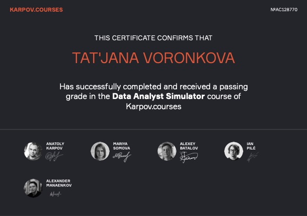
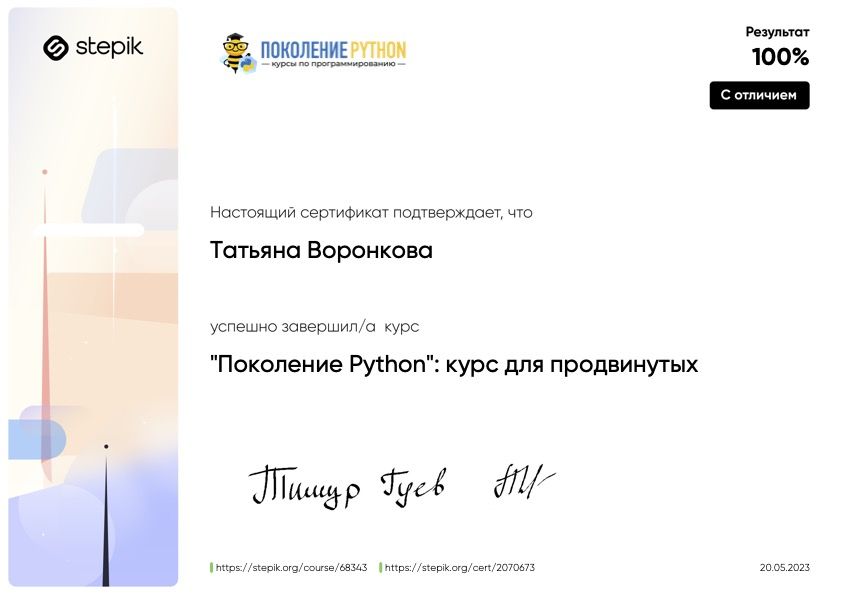
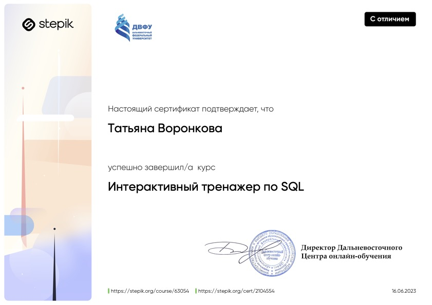
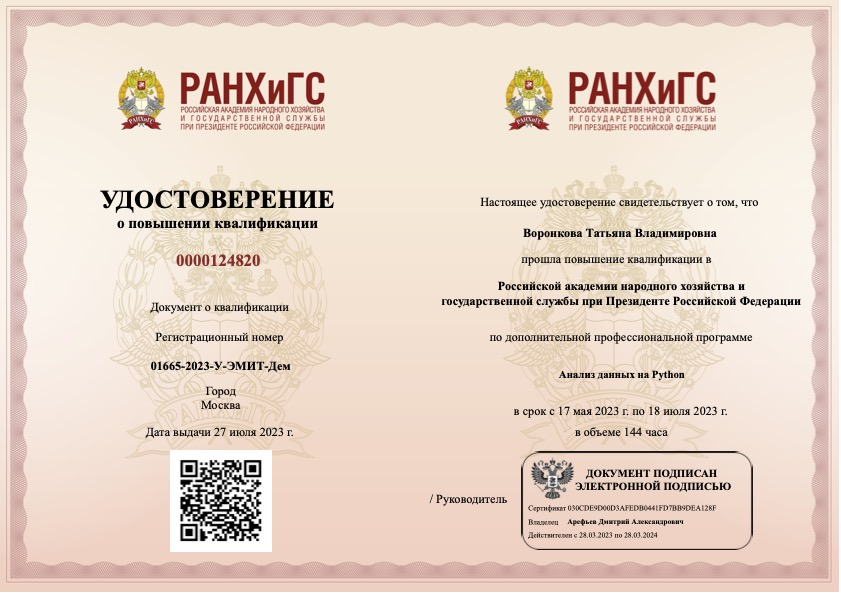
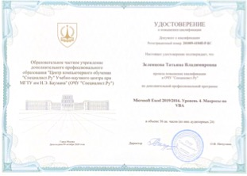
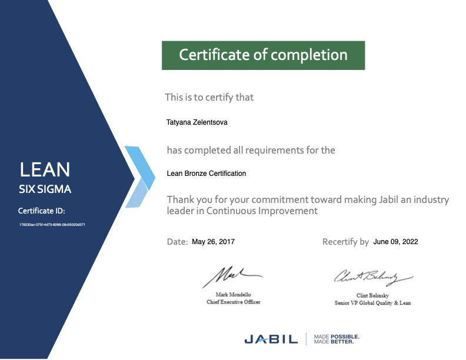

### Hi there :wave:
I am Tatiana, passionate and enthusiastic data analyst with a Master's degree in IT and Mathematics. I bring over 6 years of experience in data analysis leading the planning department in a global manufacturing company. During this time, I acquired skills in data analysis, process automation and KPIs tracking. Proficient in forecasting methods and at developing insightful KPI Dashboards, I specialize in advanced analytics techniques such as data pre-processing, statistical methods application, data visualization and insights communication.

I am currently working remotely as a freelancer and available for short-term projects and part-time longer-term engagements. Eager to leverage my diverse skill set in a new challenge within the dynamic field of Data Analytics.

### SKILLS
> * Creating complex queries in **ClickHouse** and **PostgreSQL**
> * Using **Python** in **Jupyter Notebook** for data analysis
> * Working on collaborative projects through **Jupyter Hub**, using **Git** for teamwork
> * Using **PowerBI** and **Superset** to create dashboards and visualize data
> * Conducting **A/B-tests** using statistical methods
> * Creating **ETL-pipeline** in **Airflow**
> * Setting up automatic reporting via **telegram bot** to track sudden changes in KPI

### TECH STACK 

    
### CONTACTS

### CERTIFICATES
|Data Analyst|Python|SQL|
|:---:|:---:|:---:|
| | ||
|Data Analysis|MS Excel VBA|Lean Six Sigma|
| |  |  |
